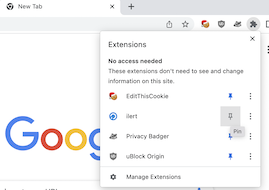

# Chrome Extension for ilert alerts

> Note: this plugin is still in BETA, we provide limited support, if you run into any issues or would like to provide feedback, feel free to open a Github issue on this repository

This plugin shows the alerts in a small badge and Chrome will notify on new alerts.

## Get started (from release)

1. Navigate to releases of this Github repository.
1. Download the latest version archive [here](https://github.com/iLert/ilert-chrome/releases/download/v0.2.0/ilert_chrome.zip)
1. Follow steps in `Installing the plugin` below

## Get started (from source)

### Building the plugin

Clone this repository, and then, in this directory:

1. `nvm use v16.17.0`
1. `npm install`
1. `npx webpack`

### Installing the plugin

To get your build plugin into Chrome do the following:

1. Open Chrome
1. Navigate to `chrome://extensions/`
1. Enable `Developer Mode` on the top right
1. Click `Load Unpacked`
1. Navigate to your local `dist/` directory (the one with `manifest.json`)

## FAQ

#### I am not getting any notifications

- Make sure to enable notifications on your devices OS for Chrome.
- Make sure your device is not in any "focus" or "do not disturb" mode
- Note that alerts of type "Low" priority will not create notifications

#### Webpack does not work

The current version of this plugin cannot be packed with Node.js > 16,
use nvm to switch to 16.

#### I am not seeing the extension in Chrome

Make sure to pin the extension to add it to your toolbar.

#### How do I login? What is organization?

You can create an api key for your ilert account
under profile -> Api Keys (read permissions are sufficient)

The origanization is your "subdomain" e.g. myaccount.ilert.com -> `myaccount`

#### When will this be available in the Chrome extension marketplace

The plugin is already fully functional, however we will keep it in BETA for a while until we move it to GA and offer it as official Chrome extension

